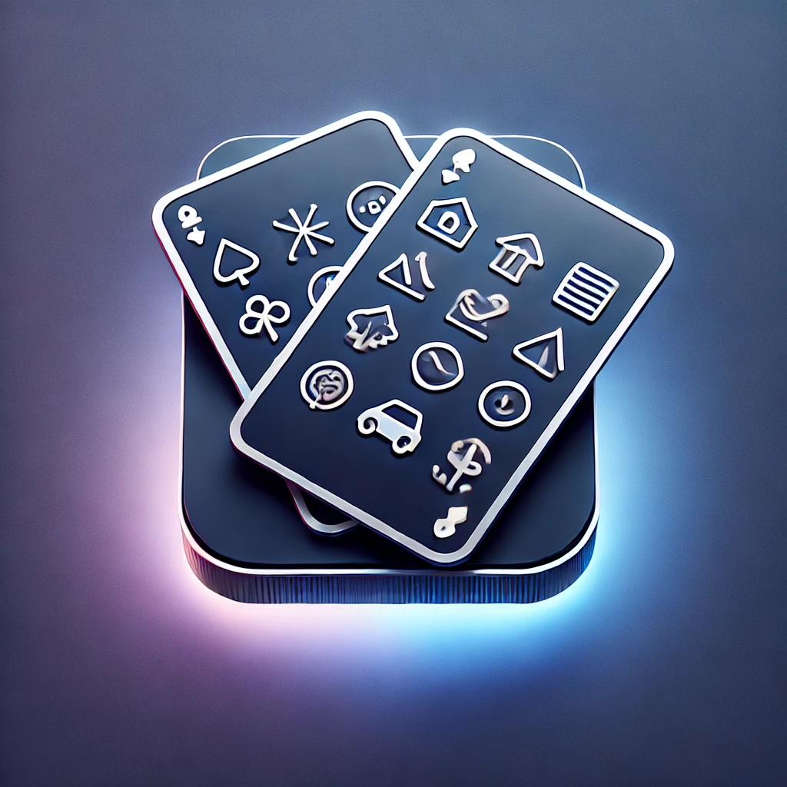

# MemoFlip for Apple Vision Pro

MemoFlip is an immersive  card matching game designed specifically for Apple Vision Pro. Challenge your mind skills by finding matching pairs of cards in a visually engaging spatial environment.

<p align="center">
  
</p>

## Features

- **Card Matching**: Classic card-flipping game 
- **Immersive Experience**: Designed for Apple Vision Pro's spatial computing capabilities
- **Beautiful Visuals**: Cards with colorful gradients and symbolic imagery
- **Sound Effects**: Engaging audio feedback for card flips, matches, and game completion
- **Score Tracking**: Keep track of your progress as you match card pairs
- **Responsive Layout**: Adapts to the Apple Vision Pro interface

## Getting Started

### Prerequisites

- Xcode 15.0 or later
- visionOS SDK
- Apple Vision Pro or Vision Pro simulator

### Installation

1. Clone the repository:
   ```
   git clone https://github.com/yourusername/VisionPro-MemoFlip.git
   ```

2. Open the project in Xcode:
   ```
   open VisionPro-MemoFlip.xcodeproj
   ```

3. Select your target device (Vision Pro simulator or physical device)

4. Build and run the application (⌘+R)

## How to Play

1. Launch the app on your Apple Vision Pro
2. Look at the card you want to flip and pinch your fingers to select it
3. Find matching pairs of cards with identical symbols
4. Match all pairs to complete the game
5. Try to achieve the highest score by making fewer attempts
6. Use the restart button to begin a new game at any time

## Game Design

MemoFlip features a variety of colorful cards with distinct symbols:
- Stars (yellow)
- Cars (blue)
- Buses (accent color)
- Clouds (cyan)
- Cats (blue)
- Birds (red)
- Fish (pink)
- Leaves (green)
- Carrots (orange)
- Houses (brown)

Each symbol corresponds to a unique visual theme, making matches easier to recognize while still providing a challenge.

## Technical Implementation

The project follows the Model-View architecture:

- **Model**: `CardFlipGameModel.swift` manages the game state, logic, and scoring
- **Views**: 
  - `CardGameView.swift` - Main game interface with card grid and score display
  - `CardView.swift` - Individual card rendering with flip animations

The game includes smooth 3D flip animations and sound effects that enhance the immersive experience on the Vision Pro.

## Future Enhancements

- Multiple difficulty levels with varying card counts
- Timer-based challenges
- High score leaderboard
- Custom card themes
- Multiplayer capabilities

## License

This project is licensed under the MIT License - see the LICENSE file for details.

## Acknowledgments

- Created by Chirag Kular
- Sound effects from Pixabay
- Icons from SF Symbols